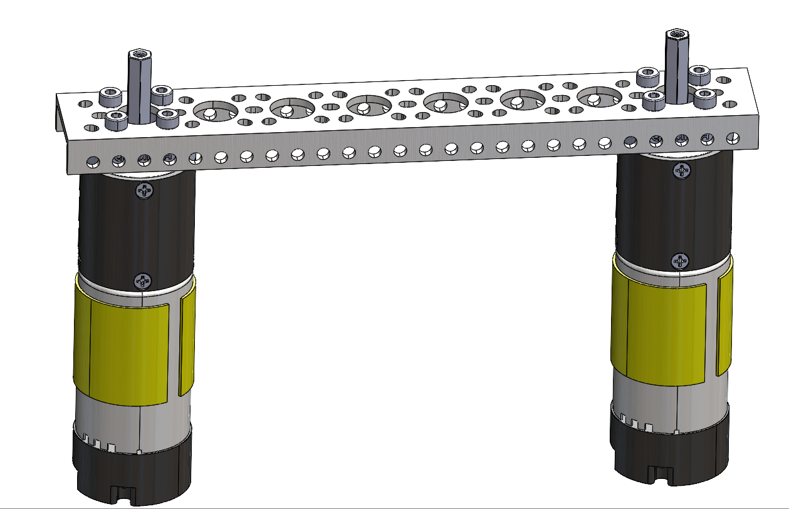
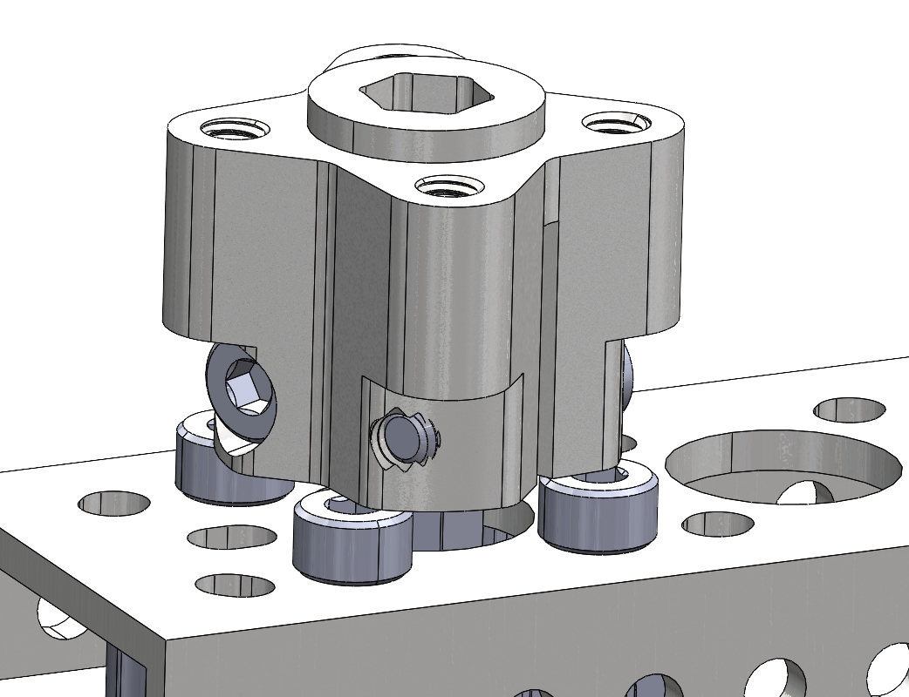
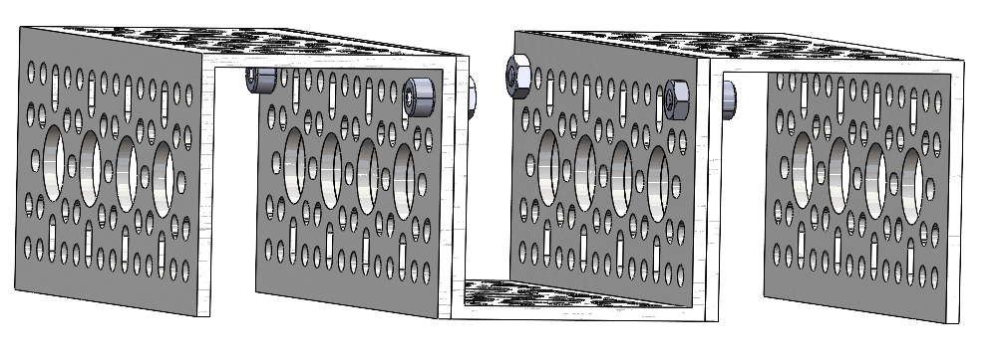
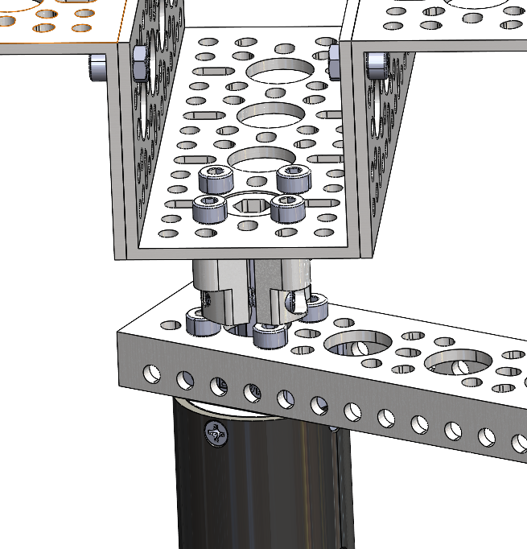
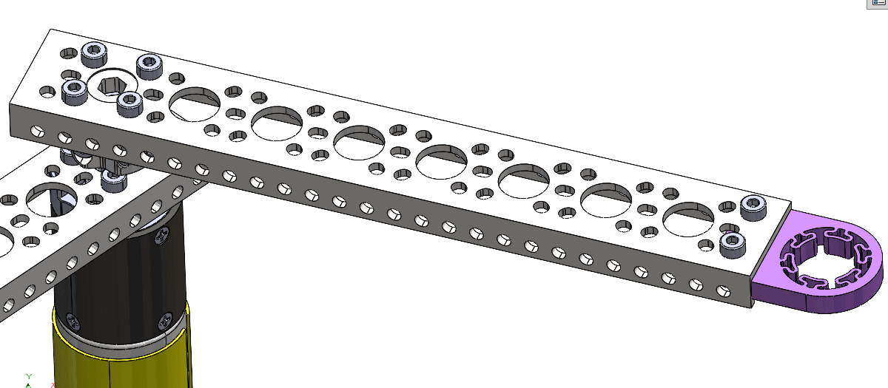
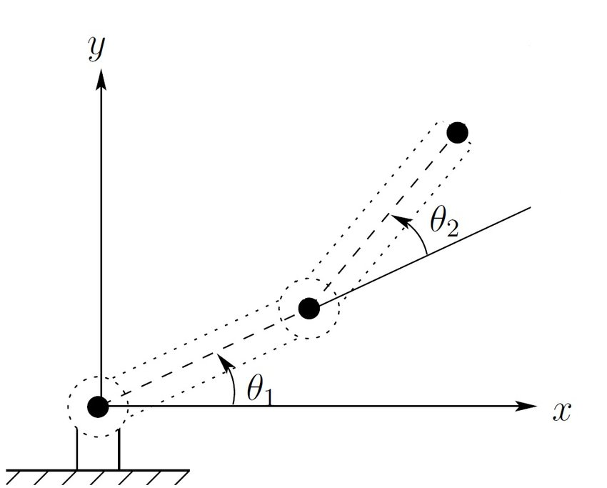

# Lab 2: 2-DoF Robot

2.12/2.120 Intro to Robotics  
Spring 2024[^1]

- [1 Hardware Assembly](#1-hardware-assembly)
  - [1.1 Nuts and Bolts](#11-nuts-and-bolts)
  - [1.2 Wiring Motors](#12-wiring-motors)
- [1.3 Validating the Motor](#13-validating-the-motor)
- [1.4 Wire Encoder](#14-wire-encoder)
- [1.5 Validating the Encoder](#15-validating-the-encoder)
- [2 Connecting Joystick](#2-connecting-joystick)
  - [2.1 Wiring Joystick](#21-wiring-joystick)
  - [2.2 Joystick Input](#22-joystick-input)
- [3 Controlling the Robot via Joystick](#3-controlling-the-robot-via-joystick)
  - [3.1 Joint Space](#31-joint-space)
  - [3.2 Draw Something](#32-draw-something)
  - [3.3 Forward Kinematics](#33-forward-kinematics)
  - [3.4 Inverse Kinematics](#34-inverse-kinematics)
  - [3.5 Cartesian Space](#35-cartesian-space)
  - [3.6 Draw Something Pt.2](#36-draw-something-pt2)
- [4 Feedback Form](#4-feedback-form)
- [X Optional](#x-optional)
  - [X.1 PID Tune?](#x1-pid-tune)
  - [X.2 Set a Path (Circle?)](#x2-set-a-path-circle)
  - [X.3 Wireless?](#x3-wireless)
    
## 1 Hardware Assembly

ADD PICTURE OF FULL ASSEMBLY IN CAD (i asked chris for screenshot, waiting for response)

### 1.1 Nuts and Bolts

You will assemble a 2-DoF arm. This section should take 30 minutes or less.

Materials:

- [2 arm links (low-side U-channel)](https://www.gobilda.com/1143-series-mini-low-side-u-channel-8-hole-216mm-length/)
- [3 base mounts (U-channel)](https://www.gobilda.com/1120-series-u-channel-4-hole-120mm-length/)
- [2 motors (60 RPM)](https://www.gobilda.com/5203-series-yellow-jacket-planetary-gear-motor-99-5-1-ratio-24mm-length-8mm-rex-shaft-60-rpm-3-3-5v-encoder/)
- [2 hubs](https://www.gobilda.com/1310-series-hyper-hub-8mm-rex-bore/)
- [socket head bolts (M4)](https://www.gobilda.com/2800-series-zinc-plated-steel-socket-head-screw-m4-x-0-7mm-8mm-length-25-pack/)
- [hex nuts (M4)](https://www.gobilda.com/2811-series-zinc-plated-steel-hex-nut-m4-x-0-7mm-7mm-hex-25-pack/)
- purple marker holder

Steps:
1. Attach the 2 motors on either end of a single arm link.
   

2. Add the hubs onto each shaft with 2 set screws.
   

3. Build the base with 3 U-channels.
   

4. Attach the base to one of the hubs.
   

5. Attach a new arm to the other hub and add the marker holder to the end of that arm.
   

### 1.2 Wiring Motors 

Explicit instructions.
Connect to rails.

## 1.3 Validating the Motor 

Run some code to actuate the motors a little back and forth.

CHECKOFF - MOTOR

## 1.4 Wire Encoder

## 1.5 Validating the Encoder 

Then run some other code to check the encoder reads on serial monitor.

## 2 Connecting Joystick

### 2.1 Wiring Joystick

### 2.2 Joystick Input

To validate that you can read the joystick input, run `joystick_test.cpp` and open your Serial Monitor. You should see joystick readings in the range `[0, 4096)`.

## 3 Controlling the Robot via Joystick

### 3.1 Joint Space

Run the file `motor_position_control.cpp` to control motor 1 and motor 2 in joint space. At a high level, this file:
- reads the joystick
- scales the joystick reading from `[0, 4096)` to `[-1, 1)`
- feeds the joystick reading to a position setpoint
- smoothes the position setpoint using exponential smoothing
- drives the motor using a PID controller

Simply put, the x-axis of the joystick controls the velocity of motor 1, and the y-axis of the joystick controls the velocity of motor 2. This is joint space!

### 3.2 Draw Something
Attach a marker to the end of your 2-DoF arm and try drawing something on your whiteboard using joint space control.

| :white_check_mark: CHECKOFF 1 :white_check_mark:   |
|:---------------------------------------------------|
| Show your work of art to a TA or LA! |

### 3.3 Forward Kinematics

First, **derive the forward kinematic equations for a 2-DoF arm**. In other words, derive equations for `x` and `y` in terms of <code>Θ1</code> and <code>Θ2</code>.

<i> What is forward kinematics? </i>

Put simply, forward kinematics answers the question, "Given the angles of the robot's joints, what are the x,y coordinates of the robot's hand?" For more, refer to lecture 2!

### 3.4 Inverse Kinematics

Using the forward kinematic equations you found, **derive the inverse kinematic equations for a 2-DoF arm**. In other words, derive equations for <code>Θ1</code> and <code>Θ2</code> in terms of `x` and `y`.

<i> What is inverse kinematics? </i>

Surprisingly, it's the opposite of forward kinematics!
Put simply, forward inverse kinematics answers the question, "Given the desired x,y coordinates of the robot's hand, what should the angles of the robot's joints be?" For more, refer to lecture 2!

### 3.5 Cartesian Space

Change `new_setpoint1` and `new_setpoint2` from joint space to Cartesian space using inverse kinematics.

Hint: MEASURE THE ROBOT WORKSPACE

### 3.6 Draw Something Pt.2

Use joystick to try draw something fun!

| :white_check_mark: CHECKOFF 2 :white_check_mark:   |
|:---------------------------------------------------|
| Show your (hopefully improved) work of art to a TA or LA! |

## 4 Feedback Form

Before you leave, please fill out https://tinyurl.com/212-feedback and present the completion screen to a TA or LA. 

## X Optional

### X.1 PID Tune?

Change the gains so that it moves smoothly. 

### X.2 Set a Path (Circle?)

Make copy of your code and modify so that it will auto follow a set path, like a circle.

### X.3 Wireless?

Rewire to make joystick wireless from the rest of the system!

| :white_check_mark: OPTIONAL CHECKOFF 3 :white_check_mark:   |
|:---------------------------------------------------|
| Demonstrate your awesome wireless joystick to a TA or LA! |

[^1]: Version 1 - 2024: Jinger Chong, Josh Sohn
